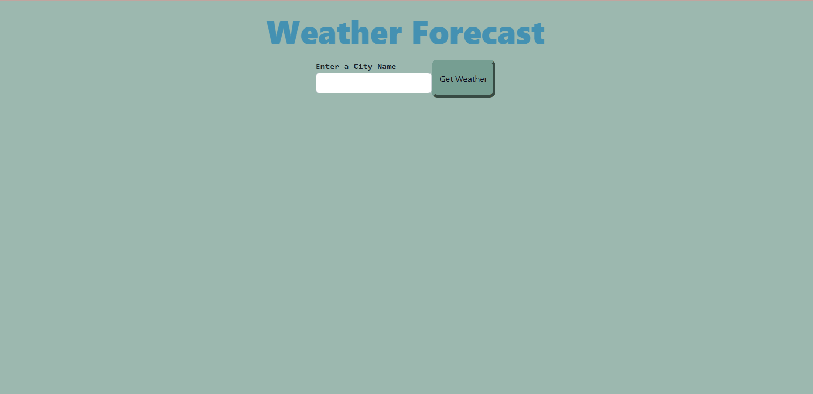

# FiveDayForecast

## Technology Used 

| Technology Used         | Resource URL           | 
| ------------- |:-------------:| 
| HTML    | [https://developer.mozilla.org/en-US/docs/Web/HTML](https://developer.mozilla.org/en-US/docs/Web/HTML) |
| | [https://www.w3schools.com/html/html_basic.asp](https://www.w3schools.com/html/html_basic.asp)     | 
| CSS     | [https://developer.mozilla.org/en-US/docs/Web/CSS](https://developer.mozilla.org/en-US/docs/Web/CSS)      |
| | [https://www.w3schools.com/css/css_intro.asp](https://www.w3schools.com/css/css_intro.asp)     |    
| Git | [https://git-scm.com/](https://git-scm.com/)     | 
| JavaScript | [https://developer.mozilla.org/en-US/docs/Web/JavaScript](https://developer.mozilla.org/en-US/docs/Web/JavaScript)     | 
| | [https://www.w3schools.com/js/default.asp](https://www.w3schools.com/js/default.asp)     |   
| | [https://davidwalsh.name/event-delegate](https://davidwalsh.name/event-delegate)     | 
| | [https://www.youtube.com/watch?v=AUOzvFzdIk4](https://www.youtube.com/watch?v=AUOzvFzdIk4)     |  
| Bootstrap    | [https://getbootstrap.com/docs/5.3/getting-started/introduction](https://getbootstrap.com/docs/5.3/getting-started/introduction) |
| JQuery    | [https://jquery.com/](https://jquery.com/) |
|     | [https://www.w3schools.com/jquery/](https://www.w3schools.com/jquery/) |
| Day.js    | [https://day.js.org/docs/en/installation/installation](https://day.js.org/docs/en/installation/installation) |
| Open Weather    | [https://openweathermap.org/forecast5](https://openweathermap.org/forecast5) |

## Description 
This is a web application that allows travelers to view the weather outlook for multiple cities and plan thier trips accordingly, The application retrieves weather data for cities using the OpenWeatherMap API and displays current and furture weather conditions.
[Visit the Deployed Site](https://beckamcnally.github.io/FiveDayForecast/)

## Learning Points 

* Retrieving data from third-party API's 
* Using localStorage to store presistent data.
* Dynamically updating HTML and CSS using JavaScript.
* Working with API's to retrieve and display data.

## Author Info

### Becka McNally

* [Portfolio](https://beckamcnally.github.io/beckamcnally/)
* [LinkedIn](https://www.linkedin.com/in/becka-mcnally-21520670/)
* [Github](https://github.com/beckamcnally)

